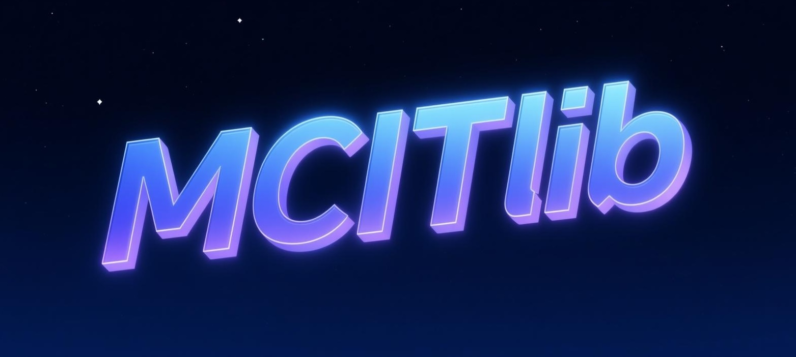

<p align="center">

</p>
<h2 align="center"> <a href="https://arxiv.org/pdf/2508.07307">MCITlib: Multimodal Continual Instruction Tuning Library and Benchmark</a></h2>
<p align="center">
  <a href="#-introduction">✨Introduction</a> •
  <a href="#-methods-provided">🥇 Methods Provided</a> •
  <a href="#-benchmarks">🏦 Benchmarks</a> •
  <a href="#-models">🎨 Models</a> <br />
  <a href="#-how-to-run">🏃 How to run</a> •
  <a href="#-acknowledgments">🤝 Acknowledgments</a> •
  <a href="#-contact">🙂 Contact</a>
</p>

<h5 align="center"> If you like our project, please give us a star ⭐ on GitHub for the latest updates. </h5>

<h5 align="center">
    
[](https://arxiv.org/pdf/2508.07307)
[](https://github.com/Ghy0501/MCITlib)
[](https://huggingface.co/MLLM-CL)
[](https://www.modelscope.cn/organization/MLLM-CL)
[](https://mp.weixin.qq.com/s/FBZw95e_0WibVbV075OyCA)
[](https://mp.weixin.qq.com/s/8xK7exmEAyDfBzFvvxugig)
[](https://zhuanlan.zhihu.com/p/1947312085248746812)

</h5>

## ✨ Introduction

MCITlib is a unified library for **continual instruction tuning** of **multimodal large language models (MLLMs)**. It integrates diverse continual learning methods into a single codebase, supporting both **image–text** and (as of v3) **video–text** setups. In addition to training scripts, MCITlib provides **standardized evaluation** across multiple benchmarks and architectures, making it easy to compare methods and reproduce results.

### Why MCITlib?

- 🚀 **Unified codebase & benchmarks:** To our knowledge, MCITlib is among the first open-source efforts to integrate both a method library and a benchmark suite for multimodal continual instruction tuning in one place.
- 🌟 **Easy to get started:** This README provides step-by-step guidance on environment setup, data preparation, training, and evaluation — designed to be accessible to newcomers.
- 🔄 **Actively maintained:** We regularly incorporate new methods, benchmarks, and base model support. See News for the latest updates (e.g., video support and the CL-VISTA benchmark in v3).

Whether you are exploring continual learning for MLLMs for the first time or benchmarking new approaches, MCITlib aims to be a practical starting point. Issues, suggestions, and contributions are welcome!

<details open><summary>🫰 We also have other multimodal continual instruction tuning projects that may interest you 🫰. </summary><p>
<!--  may -->

> [**CL-VISTA: Benchmarking Continual Learning in Video Large Language Models**](https://arxiv.org/pdf/2604.00677) <br>
> Haiyang Guo, Yichen Shi, Fei Zhu, Wenzhuo Liu, Hongbo Zhao, Fanhu Zeng, Shijie Ma, Da-Han Wang, Xu-Yao Zhang <br>
[](https://arxiv.org/pdf/2604.00677) <br>
    
> [**HiDe-LLaVA: Hierarchical Decoupling for Continual Instruction Tuning of Multimodal Large Language Model**](https://arxiv.org/pdf/2503.12941) <br>
> Haiyang Guo, Fanhu Zeng, Ziwei Xiang, Fei Zhu, Da-Han Wang, Xu-Yao Zhang, Cheng-Lin Liu <br>
[](https://github.com/Ghy0501/HiDe-LLaVA) [](https://arxiv.org/pdf/2503.12941)  <br>

> [**Federated Continual Instruction Tuning**](https://arxiv.org/pdf/2503.12897) <br>
> Haiyang Guo, Fanhu Zeng, Fei Zhu, Wenzhuo Liu, Da-Han Wang, Jian Xu, Xu-Yao Zhang, Cheng-Lin Liu <br>
[](https://github.com/Ghy0501/FCIT) [](https://arxiv.org/pdf/2503.12897)  <br>

> [**ModalPrompt: Towards Efficient Multimodal Continual Instruction Tuning with Dual-Modality Guided Prompt**](https://arxiv.org/pdf/2410.05849) <br>
> Fanhu Zeng, Fei Zhu, Haiyang Guo, Xu-Yao Zhang, Cheng-Lin Liu <br>
[](https://github.com/AuroraZengfh/ModalPrompt) [](https://arxiv.org/pdf/2410.05849)  <br>

> [**Continual Learning for Generative AI: From LLMs to MLLMs and Beyond**](https://arxiv.org/pdf/2506.13045) <br>
> Haiyang Guo, Fanhu Zeng, Fei Zhu, Jiayi Wang, Xukai Wang, Jingang Zhou, Hongbo Zhao, <br> Wenzhuo Liu, Shijie Ma, Da-Han Wang, Xu-Yao Zhang, Cheng-Lin Liu <br>
[](https://github.com/Ghy0501/Awesome-Continual-Learning-in-Generative-Models) [](https://arxiv.org/pdf/2506.13045) <br>

> [**MLLM-CL: Continual Learning for Multimodal Large Language Models**](https://arxiv.org/pdf/2506.05453) <br>
> Hongbo Zhao, Fei Zhu, Haiyang Guo, Meng Wang, Rundong Wang, Gaofeng Meng, Zhaoxiang Zhang <br>
[](https://github.com/bjzhb666/MLLM-CL) [](https://arxiv.org/pdf/2506.05453) <br>

> [**LLaVA-c: Continual Improved Visual Instruction Tuning**](https://arxiv.org/pdf/2506.08666) <br>
> Wenzhuo Liu, Fei Zhu, Haiyang Guo, Longhui Wei, Cheng-Lin Liu <br>
[](https://arxiv.org/pdf/2506.08666) <br>


</p></details>

## 📰 News
- **[2026.07]** We support DoRA for LLaVA and InternVL to facilitate advanced and stable PEFT continual learning since it has become the most popular techniques for MCIT methods. 
- **[2026.04]** 🔥🔥🔥 **MCITlib-v3** is released! This version adds **new continual instruction tuning methods**, **broader model support**, and extends the library to the **video** modality with **video benchmarks ([CL-VISTA](https://arxiv.org/pdf/2604.00677))** and **video-capable base models (Video-LLaVA & VideoLLaMA2)**—enabling continual instruction tuning and evaluation beyond classic image–text settings.
- **[2026.01]** 🔥🔥🔥 We have updated the paper in [MCITlib](https://arxiv.org/pdf/2508.07307) with the latest results. Please feel free to check it out. 🎉🎉🎉
- **[2025.10]** 🔥🔥🔥 **MCITlib-v2** has been updated! The latest version includes training and testing code for **8 mainstream multimodal continual instruction tuning methods**, compatible with **2 base models** and **3 continual instruction tuning datasets**. 🎉🎉🎉
- **[2025.09]** We have updated the new version of the [paper](https://arxiv.org/pdf/2508.07307) and attached the accuracy matrix of each method for reference. :tada:
- **[2025.08]** Initial [MCITlib](https://arxiv.org/pdf/2508.07307) paper released! :tada:
- **[2025.08]** Initial version of MCITlib is released. :tada:

## 🥇 Methods Provided
- `LoRA-FT`: Baseline method which simply updates LoRA parameters on new tasks. [[Paper]](https://arxiv.org/pdf/2106.09685v1/1000) 
- `Replay`: Experience replay baseline that randomly samples a small subset of data from previous tasks and performs joint training with the current-task data to mitigate forgetting.
- `O-LoRA`: Orthogonal subspace learning for language model continual learning. [[Paper]](https://arxiv.org/pdf/2310.14152) 
- `MoELoRA`: CoIN: A Benchmark of Continual Instruction Tuning for Multimodal Large Language Models [[Paper]](https://proceedings.neurips.cc/paper_files/paper/2024/file/6a45500d9eda640deed90d8a62742be5-Paper-Datasets_and_Benchmarks_Track.pdf) 
- `ModalPrompt`: ModalPrompt: Dual-Modality Guided Prompt for Continual Learning of Large Multimodal Models [[Paper]](https://arxiv.org/pdf/2410.05849) 
- `CL-MoE`: CL-MoE: Enhancing Multimodal Large Language Model with Dual Momentum Mixture-of-Experts for Continual Visual Question Answering [[Paper]](https://arxiv.org/pdf/2503.00413) 
- `HiDe`: HiDe-LLaVA: Hierarchical Decoupling for Continual Instruction Tuning of Multimodal Large Language Model [[Paper]](https://arxiv.org/pdf/2503.12941) 
- `RegLoRA`: SEFE: Superficial and Essential Forgetting Eliminator for Multimodal Continual Instruction Tuning [[Paper]](https://arxiv.org/pdf/2505.02486) 
- `DISCO`: Federated Continual Instruction Tuning [[Paper]](https://arxiv.org/pdf/2503.12897) 
- `SMoLoRA`: SMoLoRA: Exploring and Defying Dual Catastrophic Forgetting in Continual Visual Instruction Tuning [[Paper]](https://openaccess.thecvf.com/content/ICCV2025/papers/Wang_SMoLoRA_Exploring_and_Defying_Dual_Catastrophic_Forgetting_in_Continual_Visual_ICCV_2025_paper.pdf) 
- `MR-LoRA`: MLLM-CL: Continual Learning for Multimodal Large Language Models [[Paper]](https://arxiv.org/pdf/2506.05453) 
- `KeepLoRA`: KeepLoRA: Continual Learning with Residual Gradient Adaptation [[Paper]](https://arxiv.org/pdf/2601.19659) 

## 🏦 Benchmarks

We evaluate on three benchmarks: [UCIT](https://huggingface.co/datasets/MLLM-CL/UCIT), [MLLM-CL](https://huggingface.co/datasets/MLLM-CL/MLLM-CL) and [CL-VISTA](https://huggingface.co/datasets/MLLM-CL/CL-VISTA). Please download the corresponding images/videos and instruction files from the links above, and organize them in the following directory structure:
```
|--your_data_path
    |-- CL-VISTA
        |-- Counting
        |-- GUI
        |-- Movie
        |-- Science
        |-- Space
        |-- Sports
        |-- STAR
        |-- Traffic
        |-- train_VISTA_joint.json
    |-- Domain_data
        |-- AD
        |-- Med
        |-- RS
        |-- Sci
        |-- Fin
    |-- Ability_data
        |-- OCR
        |-- OCR_test
        |-- Math
        |-- Math_test
        |-- APP
        |-- APP_test
        |-- VP
        |-- VP_test
    |-- UCIT
        |-- datasets
        |-- ArxivQA
        |-- CLEVR-Math
        |-- Flickr30k
        |-- IconQA
        |-- ImageNet-R
        |-- VizWiz
```
You need to modify the data path in all the scripts to your own path. Additionally, method-specific data such as replay data and router training data can be downloaded from [here](https://huggingface.co/MLLM-CL).

**Note (CL-VISTA `Space`):** The **Space** split is derived from **ScanNet** and is **not** shipped as ready-to-use videos with the Hugging Face metadata. Complete the **official ScanNet access steps** (agreement and instructions in the [ScanNet](https://github.com/ScanNet/ScanNet) repository). After your access is approved, configure credentials as documented there, then **from the root of your cloned ScanNet repository** run:

```bash
python download_scannetv2.py -o data --preprocessed_frames
```

Next, run this repository’s `/your_data_path/CL-VISTA/Space/convert_video.py` to merge each frame sequence into a video, and place the results under `your_data_path/CL-VISTA/Space/` so paths stay consistent with the CL-VISTA annotation JSON from Hugging Face.

## 🎨 Models

We currently provide a reproduction based on the [LLaVA-1.5-7B](https://github.com/haotian-liu/LLaVA), [InternVL-Chat-7B](https://github.com/OpenGVLab/InternVL/tree/main/internvl_chat_llava), [Video-LLaVA-7B](https://huggingface.co/LanguageBind/Video-LLaVA-7B) and [VideoLLaMA2](https://huggingface.co/DAMO-NLP-SG/VideoLLaMA2-7B). Please download it to your local directory.
```
huggingface-cli download liuhaotian/llava-v1.5-7b --local-dir /your_model_path/llava-v1.5-7b
huggingface-cli download openai/clip-vit-large-patch14-336 --local-dir /your_model_path/clip-vit-large-patch14-336

huggingface-cli download OpenGVLab/InternVL-Chat-ViT-6B-Vicuna-7B --local-dir /your_model_path/Internvl-chat-7b
huggingface-cli download OpenGVLab/InternViT-6B-224px --local-dir /your_model_path/InternViT-6B-224px

huggingface-cli download LanguageBind/Video-LLaVA-7B --local-dir /your_model_path/Video-LLaVA-7B
huggingface-cli download LanguageBind/LanguageBind_Video_merge --local-dir /your_model_path/LanguageBind_Video_merge

huggingface-cli download DAMO-NLP-SG/VideoLLaMA2-7B --local-dir /your_model_path/VideoLLaMA2-7B
```
For the CL-VISTA benchmark, we use a locally deployed Qwen3-30B-A3B-Instruct-2507 as the judge model to evaluate the correctness of model predictions. The model can be downloaded from:
```
huggingface-cli download Qwen/Qwen3-30B-A3B-Instruct-2507 --local-dir /your_model_path/Qwen3-30B-A3B-Instruct-2507
```

Note: To meet the requirements of certain methods, we need to apply additional processing to the config file in the downloaded model. The details are outlined below:
1. add `"mm_text_select_layer": -1` and `"mm_text_tower": "/your_model_path/clip-vit-large-patch14-336"` to the `config.json` in your local model weight path.
2. remove `"temperature": 0.9` and `"top_p": 0.6` in the `generation_config.json` of your local model weight path.

We provide reference `config.json` and `generation_config.json` in `examples`.

## 🏃 How to run

Note: Our experiment is conducted in a CUDA 11.8 environment, with most libraries in the setup aligned to this CUDA version. Therefore, we recommend using `nvcc -V` to check the CUDA version on your current server. If it does not match, please install CUDA 11.8 before proceeding.
### 1. Clone this repository
```
git clone https://github.com/Ghy0501/MCITlib.git
cd MCITlib
```
### 2. Install Package for LLaVA and InternVL
```
conda create -n MCITlib python=3.10 -y
conda activate MCITlib
conda install pytorch==2.0.1 torchvision==0.15.2 torchaudio==2.0.2 pytorch-cuda=11.8 -c pytorch -c nvidia
cd LLaVA/LoRA-FT
pip install --upgrade pip
pip install -e .
pip install -e ".[train]"
```
### 3. Install packages for Video-LLaVA and VideoLLaMA2
**[VideoLLaVA]**: For official installation details, please refer to [Github](https://github.com/PKU-YuanGroup/Video-LLaVA).
```
cd Video-LLaVA/LoRA-FT
conda create -n videollava python=3.10 -y
conda activate videollava
pip install --upgrade pip  # enable PEP 660 support
pip install -e .
pip install -e ".[train]"
pip install decord opencv-python git+https://github.com/facebookresearch/pytorchvideo.git@28fe037d212663c6a24f373b94cc5d478c8c1a1d
```
**[VideoLLaMA2]**: For official installation details, please refer to [Github](https://github.com/DAMO-NLP-SG/VideoLLaMA2).
```
cd VideoLLaMA2/LoRA-FT
pip install --upgrade pip  # enable PEP 660 support
pip install -e .
pip install flash-attn==2.5.8 --no-build-isolation
```

For installing [flash-attn](https://github.com/Dao-AILab/flash-attention/releases), we recommend downloading specified version from the official repository according to your CUDA and PyTorch versions, and placing it in a local directory for manual installation. For example:
```
pip install flash_attn-2.6.3+cu118torch2.0cxx11abiFALSE-cp310-cp310-linux_x86_64.whl
```
For essential evaluation-related dependencies, please refer to the [UCIT](https://github.com/Ghy0501/HiDe-LLaVA) and [MLLM-CL](https://github.com/bjzhb666/MLLM-CL) repositories.

### 4. Path and parameter configuration

Before running any scripts, replace the placeholder paths below with the corresponding locations on your machine. Be sure to update dataset paths wherever they appear in the configs and scripts.

- Replace `/your_path/MCITlib_v3` with the absolute path to this repository on your system.
- Replace `/your_model_path/` with the directory that stores your pretrained or fine-tuned model weights.
- Replace `/your_data_path/` with the root directory of your datasets.
- Replace `/your_ckpts_path/` with the directory where training checkpoints and outputs should be written.

After updating these paths, adjust runtime parameters (for example, `gpu_num`) to match your hardware. All such settings are consolidated under the `configs/` directory.

**Tip:** In VS Code, use **Find in Folder** (workspace search) to locate and replace these placeholders efficiently.

### 5. Training and Evaluation

We provide predefined training and testing hyperparameters in the `configs` files within each method's directory, which can be adjusted as needed. The corresponding training and testing scripts are located in the `scripts` directory. Once all paths are correctly configured, the scripts should execute without issues. For example:
```
cd LLaVA/LoRA-FT
sh scripts/MCITlib/Train/train_DCL.sh
```
The program will automatically perform both training and inference. However, for ModalPrompt, training and inference must be executed separately. Please refer to its [repository](https://github.com/AuroraZengfh/ModalPrompt) for detailed instructions.

**Note:** KeepLoRA requires a sufficiently large GPU memory footprint to run. In the original environment reported by the authors, experiments were conducted on an H100 (80GB).

## Citation

```bibtex
@article{guo2025mcitlib,
  title={MCITlib: Multimodal Continual Instruction Tuning Library and Benchmark},
  author={Guo, Haiyang and Zhu, Fei and Zhao, Hongbo and Zeng, Fanhu and Liu, Wenzhuo and Ma, Shijie and Wang, Da-Han and Zhang, Xu-Yao},
  journal={arXiv preprint arXiv:2508.07307},
  year={2025}
}
```

```bibtex
@article{guo2026cl,
  title={CL-VISTA: Benchmarking Continual Learning in Video Large Language Models},
  author={Guo, Haiyang and Shi, Yichen and Zhu, Fei and Liu, Wenzhuo and Zhao, Hongbo and Zeng, Fanhu and Ma, Shijie and Wang, Da-Han and Zhang, Xu-Yao},
  journal={arXiv preprint arXiv:2604.00677},
  year={2026}
}
```

## 🤝 Acknowledgments

We gratefully acknowledge the following open-source repositories that informed or supported this work:

| Project | Repository |
|---|---|
| CL-MoE | https://github.com/ECNU-ICALK/CL-MoE |
| CoIN | https://github.com/zackschen/CoIN |
| FCIT | https://github.com/Ghy0501/FCIT |
| HiDe-LLaVA | https://github.com/Ghy0501/HiDe-LLaVA |
| KeepLoRA | https://github.com/MaolinLuo/KeepLoRA |
| LLaVA | https://github.com/haotian-liu/LLaVA |
| MLLM-CL | https://github.com/bjzhb666/MLLM-CL |
| ModalPrompt | https://github.com/AuroraZengfh/ModalPrompt |
| O-LoRA | https://github.com/cmnfriend/O-LoRA |
| SEFE | https://github.com/jinpeng0528/SEFE |
| SMoLoRA | https://github.com/Minato-Zackie/SMoLoRA |

## 🙂 Contact

If you have any questions or suggestions for new features, please open an issue or contact the author, Haiyang Guo (guohaiyang2023@ia.ac.cn).

**Contributions:** We welcome pull requests that add new continual instruction tuning **methods** or **benchmarks**. For easier reproduction and review, please follow this repository’s **existing directory and config conventions** (code, `configs/`, and scripts organized the same way as current methods under each supported base model).
